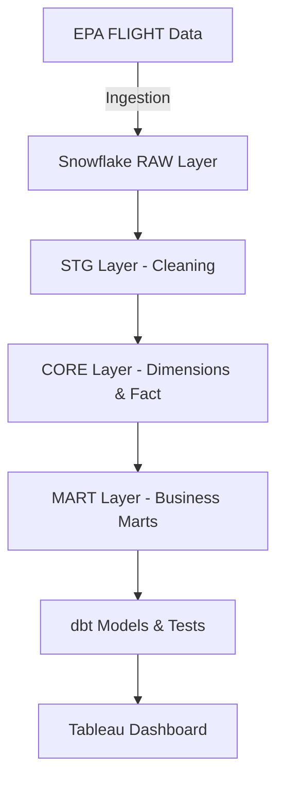

# 🌍 U.S. Greenhouse Gas Emissions Dashboard (2021–2023)

An end-to-end data analytics project built using **Snowflake**, **dbt**, and **Tableau**.\
This pipeline ingests U.S. EPA FLIGHT emissions data into Snowflake, applies structured transformations with dbt, and delivers an **interactive Tableau dashboard** for emissions analysis and what-if scenario modeling.

---

## 📐 Project Architecture



---

## 🗄️ Snowflake Setup

### 1. Database & Warehouse

We first created a dedicated Snowflake database and compute warehouse:

```sql
CREATE DATABASE IF NOT EXISTS EPA_GHG;
CREATE WAREHOUSE IF NOT EXISTS WH_GHG
  WITH WAREHOUSE_SIZE = XSMALL
  AUTO_SUSPEND = 120
  AUTO_RESUME = TRUE
  INITIALLY_SUSPENDED = TRUE;
```

- **Database:** `EPA_GHG`
- **Warehouse:** `WH_GHG` (auto-suspend enabled to save credits)

---

### 2. Lifecycle Schemas

To follow a **structured ELT lifecycle**, we defined four schemas:

```sql
CREATE SCHEMA IF NOT EXISTS RAW;
CREATE SCHEMA IF NOT EXISTS STG;
CREATE SCHEMA IF NOT EXISTS CORE;
CREATE SCHEMA IF NOT EXISTS MART;
```

- **RAW** → ingestion layer
- **STG** → staging/cleaning
- **CORE** → dimensions & fact table
- **MART** → aggregated business views

---

### 3. Unified Raw Table

Raw ingestion table with metadata tracking:

```sql
CREATE OR REPLACE TABLE RAW.RAW_GHG_EMISSIONS (
  facility_name STRING,
  state STRING,
  county STRING,
  industry_sector STRING,
  year INTEGER,
  reported_emissions_mtco2e NUMBER(38,2),
  _load_filename STRING,
  _load_ts TIMESTAMP_NTZ DEFAULT CURRENT_TIMESTAMP
);
```

---

### 4. Data Validation Queries

Some useful queries we ran to validate ingestion and transformations:

```sql
-- Count rows in raw
SELECT COUNT(*) FROM RAW.RAW_GHG_EMISSIONS;

-- Facilities by year
SELECT reporting_year, COUNT(*) AS facilities
FROM STG.STG_GHG
GROUP BY reporting_year
ORDER BY reporting_year;

-- State emissions
SELECT reporting_year, state, SUM(emissions) AS total_emissions
FROM MART.MART_STATE_EMISSIONS
GROUP BY reporting_year, state
ORDER BY reporting_year, total_emissions DESC;
```

---

## ⚙️ dbt Transformations

After ingestion, we used **dbt** to clean, model, and organize data for analytics.

### 1. Seeds

- `` → mapping of states to regions
- `` → maps EPA subparts to standardized sectors

### 2. Staging Models (`stg_`)

- `stg_ghg` → cleans raw EPA data, enforces datatypes
- `dim_state` → standardized U.S. state dimension
- `dim_sector` → cleaned sector definitions

### 3. Core Models

- `dim_facility` → unique facility-level dimension
- `fct_emissions` → **fact table** (grain: facility × state × sector × reporting\_year)

### 4. Mart Models

- `mart_state_emissions` → aggregated emissions by state & year
- `mart_sector_emissions` → aggregated emissions by sector & year
- `mart_facility_trend` → longitudinal facility-level emissions
- `mart_ghg_kpis` → precomputed KPI values for Tableau

### 5. Why dbt?

- **Layered modeling** → clear lineage (stg → core → mart)
- **Testing & validation** → row counts, uniqueness, not null
- **Documentation** → schema.yml for lineage and descriptions
- **Version control** → integrated with GitHub for reproducibility

---

## 📊 Tableau Dashboard

We built an **interactive dashboard** with KPIs, trends, and scenario analysis.

### 1. Parameters

- `p_year` → select year (2021, 2022, 2023)
- `p_reduce_pct` → what-if slider (0–50% emissions reduction)

### 2. Global Calculations

- Adjusted Emissions:
  ```text
  [Emissions (Adj)] = [Emissions] * (1 - [p_reduce_pct]/100)
  ```
- Year-over-Year % Change:
  ```text
  YoY % = (Current - Prior) / Prior
  ```

### 3. KPIs

- **Total U.S. Emissions**
- **YoY % Change**
- **Largest Sector (share)**
- **Fastest Growing State**

### 4. Visualizations

- **Emissions Trend (2021–2023)**

  - Line chart of national & sector emissions
  - Annotation: *“2023 emissions fell to 990M, down 3.9% from 2022. Cement remains the largest sector.”*

- **Top 5 States by Emissions**

  - Stacked area chart of emissions for leading states

- **Top States (Selected Year)**

  - Horizontal bar chart with drill-down

- **Facility Map**

  - Circle map by facility emissions tier
  - Tooltip includes a mini trend line

###

---

## 📷 Dashboard Preview


---

## 🚀 How to Run This Project

1. **Snowflake**

   - Create database, warehouse, and schemas (`RAW`, `STG`, `CORE`, `MART`)
   - Ingest EPA FLIGHT data into `RAW.RAW_GHG_EMISSIONS`

2. **dbt**

   - Clone repo and install dependencies:
     ```bash
     dbt deps
     dbt build
     ```
   - Run transformations:
     ```bash
     dbt run
     dbt test
     ```

3. **Tableau**

   - Connect Tableau to Snowflake (or published extracts)
   - Import `MART_*` tables as sources
   - Add parameters & calculations
   - Build dashboard with defined layout & color palette

---

## 📌 Inspiration

This project was inspired by the need to make **greenhouse gas data more accessible and actionable**.\
By combining Snowflake, dbt, and Tableau, we enable **data-driven climate insights** — helping highlight where emissions are concentrated and how they are changing over time.

---

## 📚 What I Learned

- How to design a layered ELT pipeline in Snowflake with RAW → STG → CORE → MART schemas.
- Using dbt for modular transformations, testing, and documentation.
- Creating fact and dimension models with clear grain and lineage.
- Leveraging seeds to standardize mappings (states to regions, subpart to sector).
- Building interactive Tableau dashboards with parameters, what-if analysis, and consistent color themes.
- Applying data validation checks at each step for reliability.
  
---

## 🔮 Future Improvements

- Automate ingestion with Snowpipe or external stage to refresh RAW data.
- Implement Tableau Bridge or direct connections for real-time refresh instead of extracts.
- Expand coverage to more years beyond 2021–2023.
- Add forecasting models (e.g., Prophet, ARIMA) for emission trends.
- Enhance dashboard with drill-through analysis to facility-level details.
- Add CI/CD pipeline for dbt models with dbt Cloud or GitHub Actions.
- Integrate with alerting/monitoring tools for anomalies in emissions data.

---

## 📜 License

MIT License – free to use and adapt.

---
## 👨‍💻 Author

**Jeet Patel**  
Master’s in Data Science, Indiana University Bloomington  
📫 [LinkedIn]([https://www.linkedin.com/in/jeet-rakesh-patel/](https://www.linkedin.com/in/pateljeet22)) | 📧 jeetp5118@gmail.com


